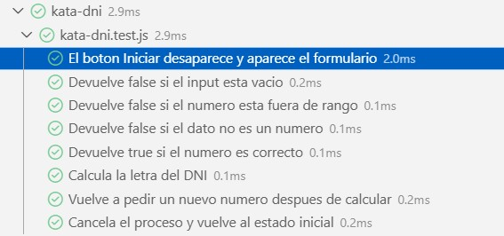

# Kata DNI

## Description

This exercise calculates the letter of a Spanish DNI from a numeric value entered by the user.

The application allows the user to:

- Start the system with the **Iniciar** button.
- Enter a DNI number with up to 8 digits.
- Validate incorrect data.
- Calculate the correct DNI letter.
- Repeat the process after each calculation.
- Cancel the process and return to the initial state.

## Algorithm

1. The number must be between `0` and `99999999`.
2. The complete number is divided by `23`.
3. The remainder of that division is calculated with modulo `%`.
4. The remainder is used as the position in the DNI letters array.
5. The corresponding letter is returned.

The DNI letters are:

```txt
T, R, W, A, G, M, Y, F, P, D, X, B, N, J, Z, S, Q, V, H, L, C, K, E
```

Example:

```txt
44444444 % 23 = 3
Position 3 = A
Result = 44444444A
```

## Acceptance Criteria

```gherkin
Scenario: Iniciar el sistema
  Given que el usuario esta en la pagina para iniciar la aplicacion
  When hace click en el boton iniciar
  Then el boton desaparecera y se le solicitara el numero para realizar el calculo

Scenario: DNI valido
  Given que introduzco un numero entre 0 y 99999999
  When calculo la letra del DNI
  Then debe devolverse la letra correspondiente segun el modulo 23

Scenario: Numero fuera de rango
  Given que introduzco un numero menor que 0 o mayor que 99999999
  When intento calcular la letra
  Then debe mostrarse el mensaje "El dato introducido es incorrecto"

Scenario: Dato no numerico
  Given que introduzco un valor que no es un numero
  When intento calcular la letra
  Then debe mostrarse el mensaje "El dato introducido es incorrecto"

Scenario: Repeticion del proceso
  Given que el usuario no pulsa cancelar
  When finaliza un calculo
  Then debe volver a solicitar un nuevo numero

Scenario: Cancelacion del proceso
  Given que el usuario pulsa cancelar
  When se detecta la cancelacion
  Then el programa debe finalizar
```

## Project Files

```txt
src/kata-dni/
|-- README.md
|-- index.html
|-- kata-dni.js
|-- styles.css
|-- styles.css.map
`-- styles.scss
```

## Technologies

- HTML
- JavaScript
- SCSS
- Vitest


## Test Screenshot



## GitHub Pages


